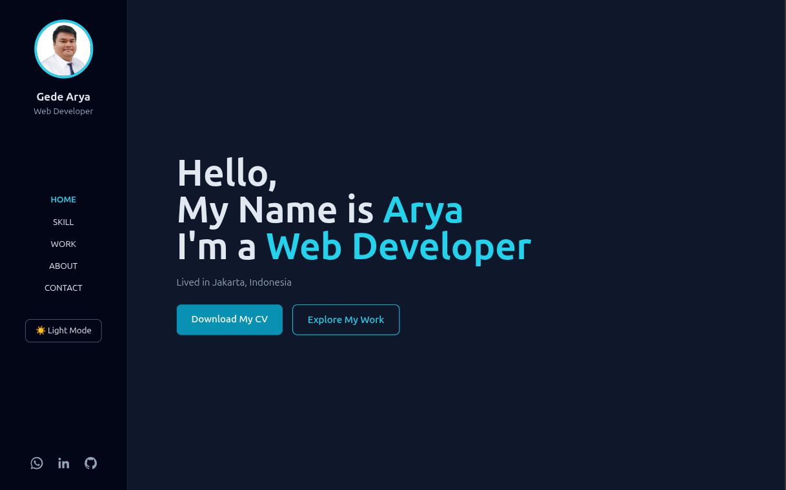
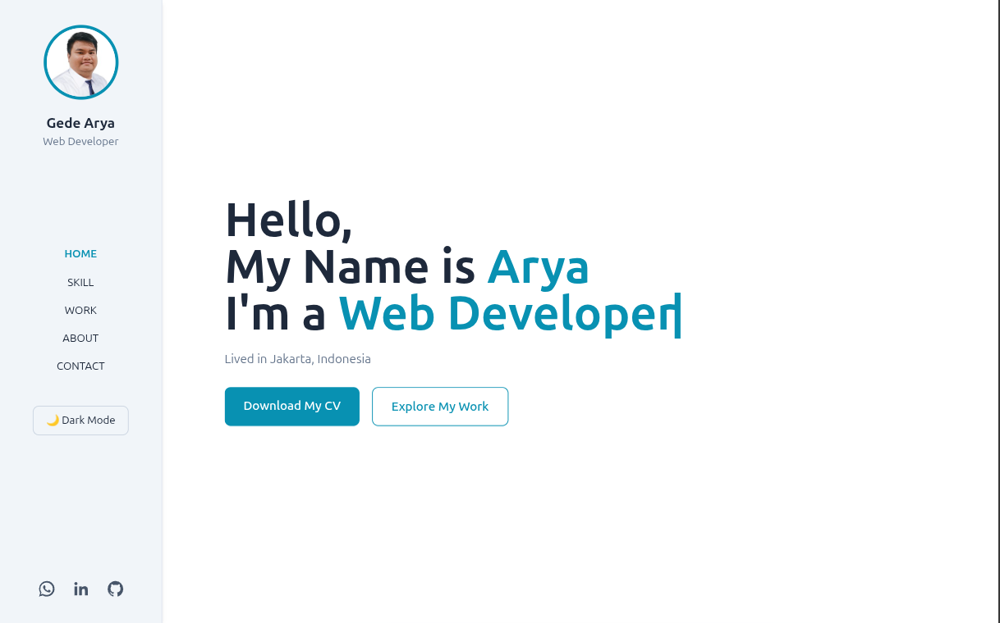

# igdarya.com

🌐 **Personal Website & Portfolio of I Gede Arya Danny Pratama**

This website is my personal branding space and online portfolio, built to showcase who I am, what I do, and what I’ve worked on. It represents my journey as a frontend-focused developer, highlighting my skills, experience, and design taste in a clean, modern, and responsive interface.

## Preview

🌙 Landing Page Dark Mode

☀️ Landing Page Light Mode

## Live Website

- 🔗 <https://www.igdarya.com/>
- 🔗 <https://igdarya.netlify.app/>

## Tech Stack

This website is built using a lightweight and performant stack:

- **HTML** – semantic and accessible structure
- **CSS** – custom styling
- **Tailwind CSS** – utility for rapid and consistent UI styling development
- **JavaScript** – interactivity and theme handling
- **AOS** – animate on scroll library
- **TypeIt** – versatile typing utility

## Features

✨ Key features implemented on this website:

- Fully Responsive Design (mobile, tablet, desktop)
- Mobile-Friendly Navigation
- Dark & Light Mode (with system preference support)
- Clean and minimal UI focused on readability and content

## Design & Inspiration

The visual style and layout are inspired by modern personal portfolio websites, especially:

- [Brittany Chiang](https://brittanychiang.com/)
- [Bappa Saha](https://bappasahabapi.vercel.app/)

These inspirations helped shape the clean layout, typography, and overall user experience.

## Figma Design

🎨 Initial design and layout exploration were created in Figma:

🔗 <https://www.figma.com/design/yPCFu9laz6Wgb7v4YNsgno/igdarya.com>

## Purpose

This website serves as:

- A personal branding platform
- A portfolio to showcase projects and skills
- A playground to experiment with UI/UX and frontend techniques

---

Feel free to explore the site and reach out if you’d like to collaborate 🚀
